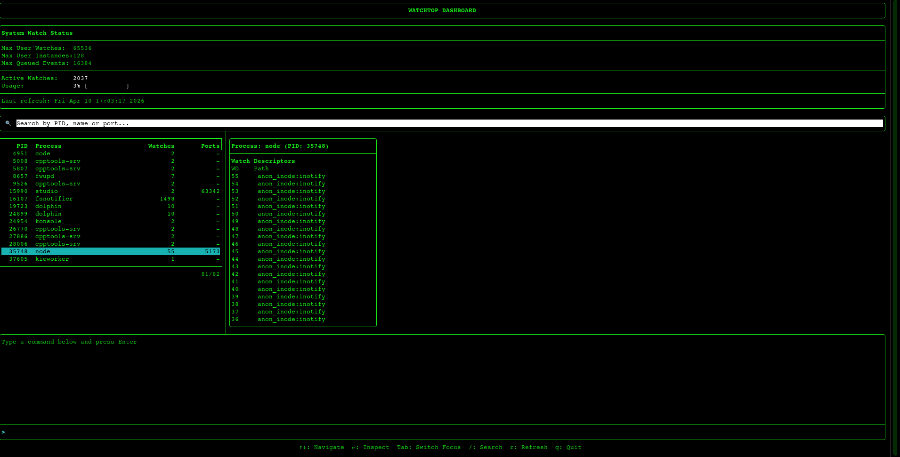
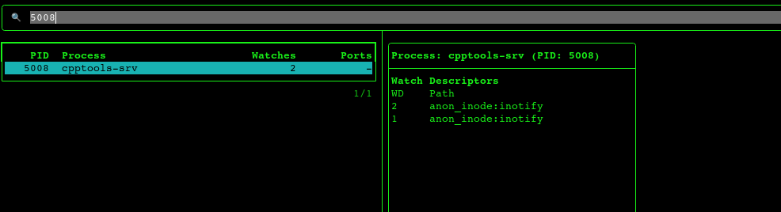
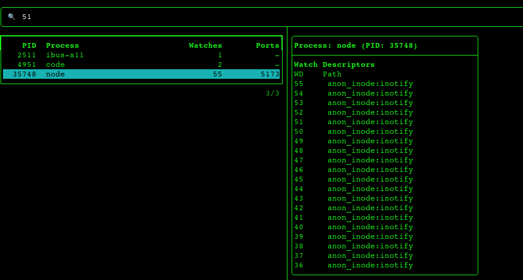
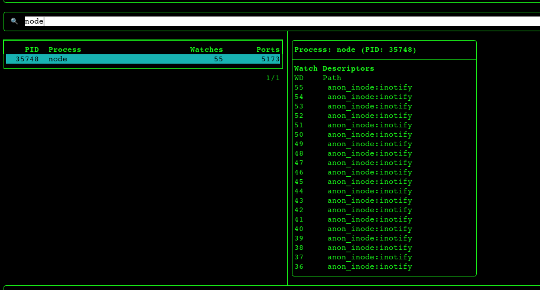

# watchtop

**watchtop** is a terminal-based real-time monitor for Linux inotify watches.  
It helps developers understand why they hit the *"inotify watch limit reached"* error and clearly shows which processes and directories are consuming filesystem watches.


## Table of Contents
- [What are inotify watches?](#what-are-inotify-watches)
- [Why is there a limit?](#why-is-there-a-limit)
- [The problem: "inotify watch limit reached"](#the-problem-inotify-watch-limit-reached)
- [How watchtop solves it](#how-watchtop-solves-it)
- [Features](#features)
- [Installation](#installation)
- [Usage](#usage)
- [Keyboard Controls](#keyboard-controls)
- [Building from Source](#building-from-source)
- [Contributing](#contributing)
- [License](#license)

---

## What are inotify watches?

**inotify** is a Linux kernel subsystem that allows applications to monitor files and directories for events (e.g., file modified, created, deleted, accessed).  

When a program wants to watch a file or directory, it asks the kernel to create a **watch descriptor**. Each active watch descriptor consumes a small amount of kernel memory and counts toward a system-wide limit.

> Think of an inotify watch as a **security camera** assigned to a specific file or folder.  
> The program says: *"Tell me whenever something happens here."*

## Why is there a limit?

The kernel imposes a **maximum number of inotify watches per user** to prevent a single user from exhausting kernel memory. This limit is configurable via:

```
/proc/sys/fs/inotify/max_user_watches
```

Typical default values range from **8192** to **524288** depending on the distribution.

While the default is generous for most desktop use, modern development workflows can easily exceed it.

## The problem: "inotify watch limit reached"

Many common tools use inotify extensively:

| Tool               | Typical watch usage                    |
|--------------------|----------------------------------------|
| **VS Code / IDEs** | Watches entire project directories     |
| **Node.js / npm**  | Watches `node_modules` for live reload |
| **Dropbox / Syncthing** | Watches all synced folders        |
| **Docker**         | Monitors container filesystems         |
| **Build systems**  | Watches source trees for changes       |

When the combined watches from all running processes exceed `max_user_watches`, new watches fail with an error like:

```
ENOSPC: System limit for number of file watchers reached
```

At this point, applications may crash, fail to start, or silently stop monitoring files—leading to confusing behavior.

**Diagnosing which process is responsible is painful without the right tool.**

## How watchtop solves it

**watchtop** provides a real-time, interactive dashboard that reveals exactly:

- Current system watch limits
- Total active watches and usage percentage
- Which processes are consuming watches
- Detailed list of watched paths per process
  
  

  **Search by PID**
  

  **Search by port**
  

  **Search by process name**
  

  With this visibility you can:

- 🔍 Identify misbehaving or over-watching processes
- 🧹 Clean up unnecessary watches
- ⚙️ Decide whether to increase the system limit
- 📊 Monitor watch usage trends over time

---

## Features

- **Real‑time updates** – Refreshes every second
- **Process table** – Sortable list of PIDs, names, and watch counts
- **Detailed view** – Shows exact watched paths for selected process
- **Integrated terminal** – Run shell commands directly inside watchtop
- **Keyboard driven** – Full navigation with arrow keys, Tab, Enter, etc.
- **Warning alerts** – Visual indicator when usage exceeds 80%
- **Cross‑distro** – Works on Ubuntu, Debian, Arch, Fedora, and others

---

## Installation

### Pre-built binaries

*Coming soon*

### Build from source (recommended)

Requirements:
- **C++20** compiler (GCC 10+ or Clang 14+)
- **CMake** ≥ 3.16
- **FTXUI** – automatically fetched during build

```bash
git clone https://github.com/yourusername/watchtop.git
cd watchtop
mkdir build && cd build
cmake ..
make -j$(nproc)
sudo make install   # optional
```

Run without installing:

```bash
./watchtop
```

> **Note:** To see watches of all users, run with `sudo`. Otherwise, only your own processes are visible.

---

## Usage

Simply launch `watchtop` from the terminal:

```bash
watchtop
```

The dashboard is divided into four main areas:

1. **System Status** – Global limits and current usage
2. **Process Table** – Left panel listing processes using inotify watches
3. **Watch Details** – Right panel showing watched paths of selected process
4. **Command Panel** – Bottom panel for executing shell commands

---

## Keyboard Controls

| Key              | Action                                           |
|------------------|--------------------------------------------------|
| `↑` / `↓`        | Navigate process list                            |
| `Enter`          | Inspect selected process (show watch paths)      |
| `Tab`            | Switch focus between process table and terminal  |
| `r`              | Manual refresh                                   |
| `q`              | Quit watchtop                                    |
| *(in terminal)*  | Type any command, press Enter to execute         |
| *(in terminal)*  | `↑` / `↓` for command history                    |

---

## Building from Source

### Dependencies
- **FTXUI** – Header-only TUI library (automatically fetched by CMake)

### Build steps

```bash
git clone https://github.com/yourusername/watchtop.git
cd watchtop
mkdir build && cd build
cmake -DCMAKE_BUILD_TYPE=Release ..
make -j$(nproc)
```

The executable `watchtop` will be placed in the `build/` directory.

### Install system‑wide (optional)

```bash
sudo make install
```

This copies `watchtop` to `/usr/local/bin`.

---

## Contributing

Contributions are welcome! Please open an issue to discuss proposed changes before submitting a pull request.

1. Fork the repository
2. Create a feature branch 
3. Commit your changes
4. Push to the branch 
5. Open a Pull Request

---

## License

Distributed under the **MIT License**. See `LICENSE` for more information.

---

<p align="center">
  Made with ❤️ for Linux users.
</p>
